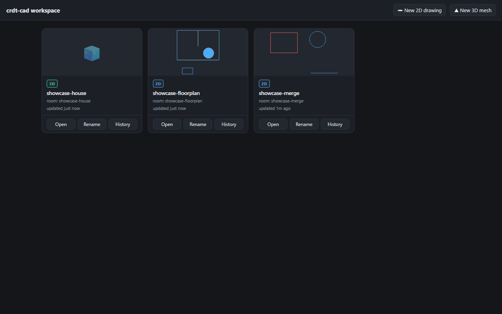
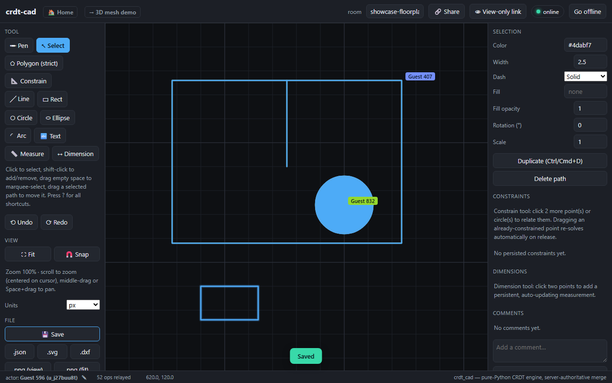
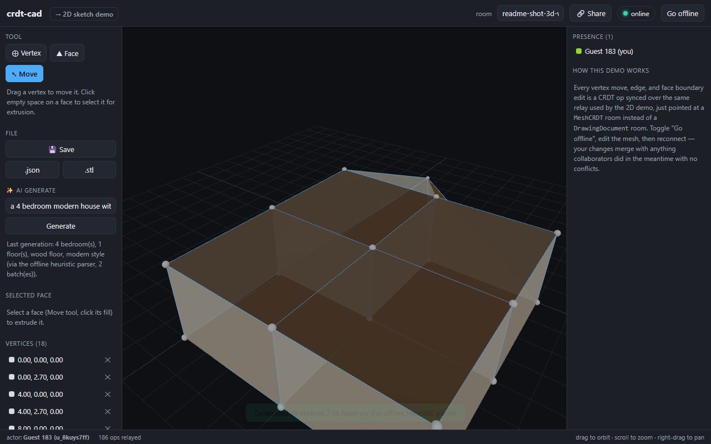
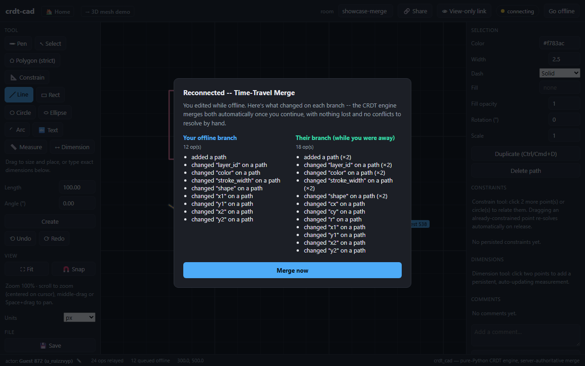

# crdt-cad

**Real-time collaborative CAD in the browser — offline-first, provably convergent, AI-assisted, and self-hostable.**

[](https://github.com/TemiKayode/cad/actions/workflows/ci.yml)
[](LICENSE)
[](pyproject.toml)
[](docs/deployment.md)

A real-time, browser-based collaborative CAD engine whose geometric data is represented entirely as CRDTs (Conflict-free Replicated Data Types), implemented from scratch in pure Python. Two collaborators can edit the same drawing while one of them is completely offline — reachable neither by the server nor by their peer — and when they reconnect, their edits merge automatically with no conflict-resolution step and no lost work. A **Time-Travel Merge** panel shows exactly what happened on each branch before the merge completes.

**What makes it different:**

- **Offline-first collaboration that actually merges.** Every edit is a CRDT operation with a Hypothesis-fuzzed convergence guarantee — not a lock, not "last save wins," not a conflict dialog.
- **Time-Travel Merge.** Reconnecting after offline edits shows both branches side by side *before* the automatic merge — the scariest moment in real-time collaboration, made visible and trustworthy.
- **AI text-to-3D that's engineered, not vibes.** An LLM interprets the prompt; deterministic geometry builds the mesh; every generation is validated (watertight, manifold, in-bounds) and scored by a 66-case eval harness in CI. Generations land as ordinary collaborative edits, with provenance, follow-up editing, and one-click undo.
- **Yours to run.** MIT-licensed, pip-installable, one-command Docker Compose, Kubernetes manifests validated on a real cluster, a TLS runbook, automated backups, and Grafana monitoring.

**Jump to:** [Quickstart](#quickstart) · [Architecture](#architecture) · [AI generation](#ai-text-to-3d-generation) · [Real-time collaboration](#real-time-collaboration) · [Testing](#testing) · [Deployment](#deployment)

<p align="center">
  
  
  
  
</p>

## Quickstart

### Local (Python venv)

```bash
python -m venv .venv
./.venv/Scripts/pip install -e ".[dev]"      # Windows; use .venv/bin/pip on macOS/Linux

./.venv/Scripts/python -m pytest tests/ -v   # 863 tests

./.venv/Scripts/python -m uvicorn crdt_cad.server.app:app --reload
```

Everything above works with zero configuration. A few heavier, genuinely optional capabilities are separate extras so the default install stays lean: `pip install crdt-cad[postgres]` (shared room state across processes), `[redis]` (cross-process broadcast fan-out), `[step]` (STEP export), `[meshy]` (the hosted mesh-generation adapter), `[accounts]` (OAuth sign-in). None of them change default behavior when omitted.

### Docker

```bash
docker compose up --build
```

Start at the workspace home page:

- `http://127.0.0.1:8000/` — workspace home (room list, rename, history)
- `http://127.0.0.1:8000/2d` — 2D sketch demo
- `http://127.0.0.1:8000/3d` — 3D mesh demo

Open two browser tabs on the same `/2d?room=` or `/3d?room=` name to see each other's edits live — over a direct WebRTC data channel when negotiation succeeds, and always over the WebSocket relay too. Click **"Go offline"** in one tab, keep editing, then reconnect: if the other tab also changed something while you were away, a **Time-Travel Merge** panel shows both branches before merging; otherwise it merges instantly.

## Architecture

```
 browser tab A                                    browser tab B
 ┌───────────────────────┐                    ┌───────────────────────┐
 │ sketch.js / mesh3d.js  │◄──WebRTC DataChannel──►│ sketch.js / mesh3d.js │
 │  - mints OpIds         │   (direct, when it     │  - mints OpIds         │
 │  - optimistic render   │    negotiates)         │  - optimistic render   │
 └──────────┬────────────┘                    └──────────┬────────────┘
            │  WebSocket (JSON ops + signaling)            │
            ▼                                              ▼
      ┌────────────────────────────────────────────────────────────┐
      │  FastAPI/asyncio relay (crdt_cad.server.app)                  │
      │  Room = { DrawingDocument | MeshCRDT, clients }                │
      │  - geometry validity gate (crdt_cad.geometry) before apply     │
      │  - applies accepted ops to its authoritative copy, persists    │
      │  - relays ops + WebRTC signaling verbatim to the rest of room  │
      │  - answers snapshot / delta-since-vector-clock requests        │
      │  - export/import (SVG/DXF/STL/JSON), /api/solve                │
      └──────────────────────────┬─────────────────────────────────┘
                                  ▼
                     SQLiteStore (crdt_cad.persistence)
                     -- one row per room, swappable for Postgres
```

The server is the single authoritative merge point. The browser client never implements CRDT conflict resolution — it only ever needs to (a) mint new ops with a locally-unique, monotonically increasing `OpId`, and (b) render whatever the server confirms. That keeps the JS side a thin, easily-auditable renderer instead of a second parallel CRDT implementation that could drift from the Python one.

## The CRDT engine

**Causal metadata** (`clock.py`): `OpId = (lamport_counter, actor_id)` is a strict total order every replica computes identically, used to break ties deterministically inside a CRDT. `VectorClock = {actor: highest_counter_seen}` tracks what a replica has already seen, used for delta sync and for detecting genuinely concurrent (offline) edits.

**`LWWRegister`/`LWWMap`/`LWWElementSet`** (`lww.py`): the last-writer-wins family, all built on one rule — every write (including a delete, represented as a tombstone) is stamped with an `OpId`; the greater `OpId` wins. `LWWMap` is the general "independently-mutable field bag" used for object/layer properties, so concurrent edits to *different* fields of the same object never conflict.

**`RGA`** — Replicated Growable Array (`rga.py`): the ordered-sequence CRDT behind sketch path points and mesh face-boundary loops. Every element remembers the id of its left neighbor at insertion time; concurrent inserts at the same anchor resolve deterministically by comparing `OpId`s, and deletion only tombstones an element so it keeps serving as a stable anchor for later inserts. `RGA.compact(safe_vc)` reclaims memory from tombstones every replica has causally observed the delete for — dropping the *value*, never the anchor metadata, since a late-arriving insert can still reference a fully-removed node's id. Convergence is proven with a Hypothesis property test that generates random insert/delete programs across three simulated replicas in arbitrary interleavings and asserts they always converge to an identical sequence.

**`MeshCRDT`** (`mesh.py`) composes the same primitives for 3D — vertices as an `LWWMap`, edges and face existence as `LWWElementSet`s, each face's boundary loop as its own `RGA` (so two people can split the same face boundary concurrently without clobbering each other), and per-face properties (material, color, provenance) as one `LWWMap` per face. Undo/redo for both `MeshCRDT` and `DrawingDocument` is *inverted ops, not snapshots*: undo synthesizes the opposite edit with a fresh `OpId` and runs it through the same merge path as any other change, so undoing your own edit never rolls back a collaborator's concurrent one. Composite entries bundle multi-op actions (an extrude that creates a full ring of vertices, sides, and a cap) into one undo step.

**Serialization**: every CRDT supports JSON (wire format), MessagePack (durable snapshots), incremental delta sync (`ops_since(vector_clock)`), and a `frontier()` vector clock sent with every snapshot/delta.

## Geometry kernel

**Constraint solver** (`geometry/constraints.py`): a `Sketch` holds named 2D points and constraints — coincident, tangent, perpendicular, parallel, fixed-distance. `sketch.solve()` runs Gauss-Newton with a numba-jitted residual/Jacobian pass (central-difference, not hand-derived analytic Jacobians, so a wrong derivative can't silently limp toward a bad answer) and falls back to plain Python automatically if numba isn't available. Correctness is checked independently of the solver's own convergence criterion — constraining only the two legs of a right triangle and verifying the *unconstrained* hypotenuse comes out to exactly 5 (a 3-4-5 triangle). Exposed both as the 2D demo's **Constrain** tool (coincident/parallel/perpendicular/fixed-distance/tangent, persistent, undoable, and re-solving automatically when a constrained point is dragged) and as a stateless `POST /api/solve` endpoint.

**Validity gate** (`geometry/validity.py`): a genuine pre-commit gate wired into the server's message handler — rejects a zero-length segment always, and (opt-in per path) a self-intersecting polygon, before the op is ever applied or broadcast. The 2D demo's **Polygon (strict)** tool demonstrates it live: draw a self-crossing shape and watch the closing edge get rejected in real time.

## Persistence and horizontal scaling

`DocumentStore` is a small interface (`save`/`load`/`list_rooms`/`delete`) with a zero-infrastructure `SQLiteStore` default — one row per room, hydrated on server (re)start, persisted on every accepted ops batch.

For real horizontal scale, `PostgresStore` (via `asyncpg`) and Redis pub/sub fan-out are opt-in via environment variable and change nothing when unset. `PostgresStore` implements the same interface against a real Postgres table; Redis pub/sub closes the gap `Room.broadcast()` otherwise has across processes — a client on server process A now sees an edit from a client on process B, with each process applying incoming ops to its *own* document (not just relaying the raw message) so a fresh connection to either process always sees consistent state. Verified with two real `uvicorn` processes, a real Postgres, and a real Redis container, and again against a live Kubernetes cluster (`kind`): both the default single-replica/SQLite mode and the 3-replica Postgres+Redis mode, with a horizontal pod autoscaler observed scaling 1→6→1 replicas under real load and a TLS ingress terminating real `wss://` traffic end to end. See `k8s/README.md`.

## Import / export

- **SVG**: export always; import handles lines, polylines, polygons, and paths including quadratic/cubic Bezier curves (`C`/`S`/`Q`/`T`, with correct smooth-reflection handling for the `S`/`T` variants real design tools export).
- **DXF**: export/import via `ezdxf` — shape primitives export as native `LINE`/`LWPOLYLINE`/`CIRCLE`/`ARC`/`ELLIPSE`/`TEXT` entities, and freehand/polygon path curve segments export as genuine `SPLINE` entities (a quadratic segment is degree-elevated to an exactly-equivalent cubic first) rather than a flattened polyline. Import reads `LWPOLYLINE`/`LINE`/`POLYLINE` back as their literal points and samples `CIRCLE`/`ARC`/`ELLIPSE`/`SPLINE` into point lists.
- **STL**: ASCII export for the 3D mesh.
- **STEP**: real `AP214` export via `build123d`, turning each mesh face into a planar `Face` and emitting a proper `MANIFOLD_SOLID_BREP` when the mesh closes into one watertight solid — and the reverse: **import** tessellates a real STEP file's solids back into `MeshCRDT` triangles (`Shape.tessellate`), welding OpenCascade's per-face-duplicated vertices back down to one entry per position.
- **glTF (`.glb`) / 3MF**: real binary exports via `trimesh`'s own exporters for the 3D mesh.
- **PDF**: a 2D room can define one or more print **sheets** — page size (A4/A3/Letter/Tabloid), orientation, margin, and either an auto-fit print scale or an explicit drafting ratio (e.g. "1:10") — each with its own collaboratively-editable title block (title, drawn by, date, drawing number, revision, notes). Rendered via `reportlab`: curve segments become real bezier paths, shapes and dimensions render natively, and everything is sampled through one shared coordinate transform rather than reaching for the target format's own arc/ellipse primitives (see `pdf_io.py`'s module docstring for why).

All reachable from the UI: an explicit **Save**, per-format download buttons, a **Sheets** panel for page setup/title blocks/PDF export, and (2D) an **Import SVG/DXF** / (3D) an **Import STEP** picker that broadcasts the imported geometry to everyone in the room. IFC and DWG are deliberately not supported — see **`docs/ifc_dwg_assessment.md`** for why (a real data-model gap for IFC, a licensing wall for DWG) and the standard DXF-based workaround for the latter.

## AI text-to-3D generation

Type a prompt like *"a wooden dining table"* or *"a 4 bedroom house with a gable roof and a garage"* into the **AI Generate** box on the `/3d` demo, and a real, watertight, collaboratively-editable mesh appears in the scene for everyone in the room — built and synced through the exact same CRDT machinery as a hand-placed vertex.

The pipeline splits the problem into its two real sub-problems: **language understanding** (which generator, and its own bounded structured parameters — squarely an LLM-shaped problem, where Claude is used via real tool-use, one tool per generator, with a heuristic keyword-dispatch fallback that runs with zero API key needed) and **3D construction** (never asked of the model — every generator is a `(bounded pydantic spec, deterministic build function)` pair; every vertex, edge, and face loop is computed geometry).

- **A 14-generator registry** — house (with pitched roofs, garages, multi-story footprints, and real CSG-cut doors/windows), primitives (box/cylinder/cone/torus), furniture (table/chair/shelf), and architectural elements (stairs/column/arch/fence) — every one an assembly of shared, independently-watertight primitive builders.
- **Scene composition**: "a table with four chairs around it" — the model only ever names *which* generators, *how many*, and their spatial relation (around/on-top-of/row/beside); a deterministic layout solver computes real coordinates from each object's actual measured bounding box.
- **A sandboxed geometry DSL** for open-vocabulary shapes no registry generator covers: a small, closed JSON grammar (primitives, transforms, real CSG booleans) — never Python, never raw vertices, never `eval` — with hard resource caps checked before and during execution, and an execute → validate → repair → fallback loop so a malformed program never dead-ends the user.
- **Provenance, follow-up edits, and one-unit undo**: every generation is tagged and selectable as a whole; "make it taller" regenerates in place under the same id; undo reverts both the geometry and the record in one step.
- **A measured eval harness wired into CI**: 66 golden prompts across six categories (every generator, house field extraction, scene composition, ambiguous/adversarial/non-English degradation), scored against the real pipeline on every push — **currently 66/66 (100%)**.
- **Report cards, Prometheus metrics, a real cancel button, and budget guardrails**: every generation produces a structured watertight/manifold/planar/in-bounds report, increments labeled counters and a latency histogram, and a Cancel button genuinely aborts an in-flight request server-side.
- **An optional hosted-ML tier** (Meshy AI) behind `MESHY_API_KEY`, with a real async job flow, live progress streaming over the WebSocket, and quadric-error mesh decimation to keep a diffusion model's tens-of-thousands of triangles within a collaborative-editing budget.

Pre-commit validation (watertight, manifold, winding-consistent, in-bounds) runs on every generator's output before it ever becomes an op; a failed generation returns a structured error the UI renders directly, never a bare exception.

## Real-time collaboration

**WebRTC P2P**: direct browser-to-browser sync via `RTCPeerConnection` and a `DataChannel`, with the WebSocket relay carrying only the signaling handshake. Every op is *also* sent over the relay — P2P is a latency optimization layered on top, never a replacement, since the relay is what persists state and serves late joiners.

**Time-Travel Merge**: when a client reconnects after an offline stretch and *both* it and the room changed something while it was away, the client doesn't auto-apply the remote delta — it shows both branches side by side in plain language ("added a layer," "extended a path (×4)"...) before merging. It's a review step, not a manual conflict-resolution step: the convergence guarantee it's visualizing already holds before the button is pressed.

**Cross-component mesh validity**: after any merge that could create a cross-component inconsistency in a mesh (a face boundary referencing a vertex a concurrent edit deleted, non-manifold topology from a genuine edit race), the server re-checks the room's merged mesh and broadcasts a warning — never a rejection, since an already-merged CRDT operation can't be rolled back without breaking convergence. The client outlines the affected faces in red with a dismissible banner naming the problem; a human decides whether to fix or delete them.

**Comments, mentions, and activity**: both demos support threaded, per-object comments (anchored to a path in 2D, a face in 3D) as ordinary CRDT ops — they merge, persist, and sync exactly like geometry, and work in zero-config tokens-only mode with no account needed. A `commenter` role can add comments but never touch geometry, enforced per-op server-side, not just hidden client-side. In accounts mode, `@email` mentions inside a comment resolve to real accounts and land as a notification (a bell in the workspace top bar, badge and all) — skipped for anyone who couldn't actually reach a private room, so a mention never leaks visibility into content someone shouldn't see. Each room also keeps a lightweight activity feed (comments, AI generations) visible in its own side panel.

## Security and production hardening

Zero-config local development is completely unaffected by anything below — every mechanism here is opt-in via environment variable.

- **Shared-secret room tokens**: signed, room-and-kind-scoped credentials with a configurable expiry, enforced identically at both the WebSocket handshake and every room-scoped REST endpoint. A **Share** button embeds the token in the invite link so a recipient never has to know or enter a secret themselves; a rejected or expired token clears itself client-side rather than looping forever.
- **CORS**: wide open only when no secret is configured; locked to same-origin the moment one is, or an explicit allowlist always wins.
- **Rate limiting**: a hand-rolled continuous-refill token bucket — per-connection WS ops/sec, a per-room ops/minute ceiling, and a per-client-IP limit on the AI generation endpoint that applies even with room auth off, since an LLM call and mesh construction cost real time and money regardless of access control.
- **Resource ceilings**: max WebSocket frame size, max ops per message, max rooms per server process, max clients per room, and (opt-in) a soft per-room cap on live path/face count — every one env-tunable, every violation closes the connection or refuses the one over-budget new element with a distinct, documented reason rather than a silent drop. Deleting an element always frees its slot back up; an already-merged remote op is never rejected retroactively, since that would break CRDT convergence.

## Identity, permissions, and teams

Layered identity, ownership, and organizations, each opt-in and fully backward-compatible with the token-only mode above — a deployment that never sets `CRDT_CAD_AUTH_MODE=accounts` is byte-for-byte unaffected by any of this.

- **Accounts**: magic-link sign-in (no passwords — a time-limited signed link by e-mail, or console-echoed for local development) and OAuth (Google, GitHub via `authlib`). Sessions are server-side, cookie holds only a hash, so "sign out everywhere" is a real row deletion, not a client-side hope.
- **Document ownership and sharing**: the first signed-in user to open a genuinely new room claims it automatically as private; visibility is private/link/public, and per-user roles (owner/editor/commenter/viewer) can be granted by e-mail — even to someone who's never signed in yet. The account-based permission system composes with (never replaces) the token system: an already-distributed share link keeps working even on a room that's since gone private.
- **Organizations and teams**: an org has admin/member roles, and transferring a document to one makes it visible and editable to every active member automatically — an admin manages it like an owner, a member edits it like an editor, with no per-person invite needed for each new document. Invites carry a real pending state that activates the moment the invitee actually signs in for the first time. An org can also set per-org defaults (new-document visibility, which share-link roles it allows).
- **Per-org SSO**: any organization can delegate sign-in to its own OIDC identity provider (Okta, Entra ID, Google Workspace, or anything else that publishes standard discovery) and capture its own e-mail domain — a sign-in attempt against that domain, magic link or generic OAuth, gets redirected straight to the org's own flow instead. Configured per-org, not per-deployment, with the client secret write-only from the moment it's set.
- **Quotas and an operator admin panel**: opt-in per-user daily caps on AI generations, share links, and owned documents (`CRDT_CAD_QUOTA_*`), and a real operator surface at `/admin` — bootstrapped by `CRDT_CAD_ADMIN_EMAILS`, no database flag and no chicken-and-egg on who grants the first admin — for listing every user and org, disabling an abusive account, and claiming or deleting any room.
- **Org subscriptions**: real Stripe Checkout and a Stripe-hosted billing portal, gating a free plan's member seat cap — an org's plan/status are only ever trusted from Stripe's own webhook (never the checkout redirect itself, which can be abandoned before payment completes), so the two can never drift out of sync. Entirely opt-in behind `CRDT_CAD_STRIPE_SECRET_KEY`; a deployment that never sets it keeps unlimited org membership, exactly as before this existed.
- **Data rights and moderation**: a signed-in account can export its own data (profile, owned/shared rooms, org memberships, notifications) as JSON or delete the account outright — deletion releases any personally-owned rooms rather than destroying them, since other collaborators may still depend on that content, and past comments in room history keep their author's name as the plain-text snapshot it always was, never a live reference to the deleted account. Anyone viewing a room (signed in or not) can flag it for moderator review; an operator triages open reports from the admin panel.

The workspace home page reflects all of this: a visibility badge, an owner-only **Share** modal for managing grants and organization transfer, and an **Organizations** panel for membership, defaults, and SSO.

## The apps

All three pages are plain HTML/CSS/vanilla JS — no build step, no npm project. The 3D demo additionally loads Three.js from a CDN via an import map, the only external runtime dependency any of the three frontends has.

**Workspace home** (`/`): lists every room ever saved, with a real SVG thumbnail for 2D rooms, rename, and version history with one-click restore (which forks the chosen version into a new room rather than rewriting live history — a live room's causal history can't be rewound in place without breaking convergence for anyone still connected).

**2D sketch** (`/2d`): pen and shape tools (Line/Rect/Circle/Ellipse/Arc with live numeric dimension input), a select tool with multi-select, transform, duplicate, copy/paste, align/distribute, and object snapping, a persistent constraint system (coincident/parallel/perpendicular/fixed-distance/tangent, re-solving automatically on drag), mirror and linear/circular array (built on the same per-path transform every other move/rotate/scale already uses, so an already-transformed source mirrors and arrays correctly too), a shapely-backed offset tool that handles concave corners correctly (unlike a naive "shift every edge outward" approach), a fillet tool for rounding a freehand path's corner to a chosen radius, trim/extend that shortens or lengthens a path's endpoint to meet another path (one operation either way, whichever the geometry calls for), Measure and Dimension tools, text/fills/stroke styles/groups, reusable **components** (turn any one path into a live definition; every placed instance re-resolves its geometry from the definition on every render, so editing the master updates every instance immediately, no copy ever goes stale), print sheets (page setup + a collaboratively-editable title block, exported to PDF independently of the live drawing), a real pan/zoom/grid viewport with document units (px/mm/in), live multi-user cursors and presence, comments, undo/redo, and export to JSON/SVG/DXF/PDF/PNG.

**3D mesh** (`/3d`): click-to-place vertices and faces, drag to move, extrude with one bundled undo step, per-face color and material, parametric primitives (Box/Cylinder/Pyramid/Plane) with grid/vertex snapping, real mesh **booleans** (Union/Subtract/Intersect via `trimesh`/`manifold3d`, operating on whole placed objects), axis-aligned view shortcuts, the AI Generate panel, export to JSON/STL/STEP/glTF/3MF, and STEP import (tessellated back into live, editable mesh geometry). A flag-gated (`CRDT_CAD_PARAMETRIC_PROTOTYPE`) parametric-Box prototype demonstrates edit-the-parameters, regenerate-the-mesh workflows on a narrow, honest scale — see `docs/brep_design.md` for the full B-Rep/parametric-kernel design writeup and why it stops there.

**Admin panel** (`/admin`, accounts mode + `CRDT_CAD_ADMIN_EMAILS` only): a real operator surface, not just REST endpoints — every user with a disable/re-enable toggle, every organization, and every owned room with a delete action, gated client-side on `is_platform_admin` and re-checked server-side on every request regardless of what the page shows.

Both demos share a hand-written design token system (color for dark and light themes, typography, spacing, motion), a full icon set with no emoji glyphs, a command palette (Ctrl/Cmd+K) covering every action in the app, single-key tool shortcuts, a searchable keyboard-shortcut overlay, full keyboard reachability (skip links, focus traps, visible focus rings), smooth eased remote cursors with per-actor color, a "follow" mode that re-centers your viewport on another collaborator, and an honest connection/save status cluster that reflects exactly what this architecture actually guarantees rather than a generic autosave spinner. A 500-path 2D document renders in ~1.1ms per frame on average; cumulative layout shift across all three pages measures 0.002–0.010, an order of magnitude under the "good" threshold.

**Installable, touch-ready**: a Web App Manifest and a root-scoped, network-first service worker (falling back to a cached app shell, never to stale room data — `/api/*` and `/ws/*` are always live) make every page installable as a standalone app on desktop and mobile. Pointer Events already unify mouse/touch/pen for every existing tool; the 2D canvas additionally supports two-finger pinch-to-zoom and pan (with `pointercancel` handling so an OS-interrupted gesture, e.g. an incoming call, never leaves a phantom touch stuck mid-pinch), and `touch-action: none` on both canvases hands gesture handling entirely to the app instead of fighting the browser's native scroll/zoom.

**Large-document performance**: the 2D canvas culls off-screen paths before doing any of the actual drawing work, so render time grows far slower than document size — a 100x larger document (measured 50 → 5000 paths) costs roughly 24x more render time, not 100x, when only a handful of paths are ever on screen at once, the realistic case for one big shared room. The 3D scene sheds its per-edge helper-line overhead (never the actual faces or the vertex markers used for editing) past 300 live faces — a real, verified-correct, safe reduction, though at the scale measured its effect on frame rate was within run-to-run noise, since face and vertex objects (unchanged by this pass) still dominate a large mesh's object count. Every number here is backed by real, rerunnable measurements, honestly reported including the inconclusive ones — see `docs/perf_benchmarks.md` and `scripts/bench_*.py`. Two new opt-in soft ceilings, `CRDT_CAD_MAX_PATHS_PER_ROOM`/`CRDT_CAD_MAX_FACES_PER_ROOM` (unlimited by default), refuse a genuinely new element once a room is at budget without ever touching what's already there.

## Testing

```bash
./.venv/Scripts/python -m pytest tests/ -v
```

**863 non-browser tests**: unit tests for every CRDT type and geometry module, serialization round-trips, a full-mesh merge-convergence test for RGA, a Hypothesis property test fuzzing random concurrent insert/delete programs across three replicas, import/export round-trips for every supported format (including DXF curve segments round-tripping through genuine SPLINE entities, not flattened polylines, PDF sheet rendering, STEP import's OpenCascade-tessellation vertex welding, and component instances resolving into real geometry), real mesh boolean operations (including a live-caught regression where a real placed primitive's inside-out winding needed normalizing before manifold3d would accept it), the constraint solver's independent correctness checks, the offset tool's shapely-backed geometry (including the concave-corner case a naive implementation gets wrong), persistence save/load/restart-hydration, WebSocket protocol tests covering the relay, reconnect-with-delta, the validity gate, and the WebRTC signaling relay's targeted delivery, the full AI generation pipeline (heuristic and mocked-LLM interpretation, every generator's geometry invariants, the DSL's validation/repair/fallback loop, the 66-case eval harness), security hardening (every auth gate, every rate limit and resource ceiling actually tripping), account/permission/organization storage and REST/WS enforcement, SSO domain capture, disabled-account gating, per-user quotas, the admin panel's own access control, 3D comments and @mention notification eligibility, Stripe billing's webhook-driven plan sync and free-plan seat cap (mocked at the Stripe client boundary), GDPR export/account-deletion cascades and abuse-report moderation, and Postgres/Redis integration tests that skip cleanly when neither is reachable.

**91 browser tests** (Playwright, opt-in via `pytest -m e2e`, excluded from the default run so a fresh checkout without Chromium still passes): two tabs drawing concurrently and converging; the full offline → edit both sides → reconnect → Time-Travel Merge → converge sequence; a real `RTCPeerConnection` negotiating between two headless Chrome tabs; the offline outbox surviving a hard refresh; the full account sign-in, sharing, and organization flow end to end with multiple real browser contexts; and a dedicated regression test per non-trivial bug found during development. Each spins up a real `uvicorn` subprocess against its own temp SQLite file, exercising the actual client JS against the actual relay, not an in-process test double.

`.github/workflows/ci.yml` runs on every push: `pytest` + `ruff check`, the full e2e suite, and a Docker build — as independent jobs.

## Deployment

See **`docs/deployment.md`** for the full runbook and **`docs/configuration.md`** for every environment variable.

- **Docker**: `docker compose up --build` for local dev; `docker-compose.prod.yml` + a committed Caddyfile for a single-VPS production deployment with real HTTPS, `wss://` through the proxy, and a proxy-aware rate limiter.
- **Kubernetes**: manifests under `k8s/`, validated on a real cluster — both the default single-replica mode and a horizontally-scaled Postgres+Redis configuration, with HPA and TLS ingress. See `k8s/README.md` before touching `replicas`.
- **Fly.io**: `fly.toml` for a single always-on machine with a volume-mounted SQLite database — live-deployed and verified (real token-authenticated WebSocket session, an op saved and confirmed durable across a fresh reconnect), with CI-gated continuous deployment on every push to `main`. See `docs/deployment.md`.
- **Backups**: `scripts/backup_sqlite.py` (SQLite online-backup API, safe against a live writer) and documented `pg_dump`/`pg_restore` for Postgres, both with automated restore tests.
- **Graceful shutdown**: SIGTERM persists every room with unpersisted ops before the process exits, verified against a real container stop.
- **Monitoring**: `/metrics` is real `prometheus_client` output (connections, ops relayed, geometry rejections, merge latency, AI generation outcomes/latency), with a ready-made Grafana dashboard and alert rules.
- **Load testing**: `scripts/load_test.py` drives N rooms × M WebSocket clients; the current build sustains 600 concurrent clients with zero op loss.

## Engineering decisions worth knowing about

**Offline durability.** Every edit is applied optimistically to local state and queued for the server the moment it's made — going offline doesn't disable editing, it queues emitted ops in an outbox that survives not just a dropped connection but a hard refresh or closed tab too (persisted to IndexedDB, keyed per room and actor), replayed on top of a fresh server snapshot on reconnect.

**Tombstone memory growth.** `RGA.compact(safe_vc)` reclaims memory from any tombstone whose delete every replica has already causally observed — dropping the stored value while permanently keeping the node's id and anchor metadata, since a long-offline replica can still arrive with an insert anchored to that node. Full node removal would need a distributed causal-stability protocol this project doesn't implement; value-only compaction is safe without one.

**Non-commutative mesh edits.** A face-boundary edit racing an extrude of that same face is a genuinely hard case for any mesh CRDT: each sub-component (vertices, edges, face index, per-face boundary loops) merges correctly on its own terms, but the combined result can be topologically inconsistent — and rejecting a CRDT merge outright breaks convergence, so that was never the right lever to pull. Instead, a post-merge validity check (`check_mesh_validity`) runs after any op that could create this class of problem, checking for degenerate faces, non-manifold edges, inconsistent winding, and dangling face references, and broadcasts a warning — never a rejection — so a human can fix or delete the affected geometry. A structurally different DAG-based B-Rep representation would make these edits merge more predictably, but is a large enough data-model change to be future work rather than something this pass attempted.

## Project layout

```
src/crdt_cad/
  crdt/
    clock.py, lww.py, rga.py, mesh.py, document.py, serialize.py
  geometry/
    constraints.py   Sketch / Constraint / numba-jitted Gauss-Newton solver
    validity.py      zero-length / self-intersection checks, the pre-commit gate
    mesh_validity.py trimesh-based post-merge mesh checks
  export/
    svg_io.py, dxf_io.py, stl_export.py, step_export.py (optional build123d extra)
  ai/
    house_spec.py       bounded pydantic model the pipeline builds from
    interpreter.py      LLM prompt interpretation + regex heuristic fallback
    procedural_house.py deterministic, watertight-by-construction mesh builder
    generator.py         prompt -> spec -> mesh -> batched CRDT ops
    mesh_repair.py       optional pymeshlab print-prep (non-manifold repair, Poisson)
    meshy_adapter.py     optional hosted text-to-3D API tier (MESHY_API_KEY)
  persistence/
    store.py         DocumentStore interface, SQLiteStore, PostgresStore, InMemoryStore
    accounts.py       accounts, sessions, room ownership/grants, organizations
  server/
    app.py            FastAPI WebSocket relay + REST (export/import/solve/AI-generate)
    auth.py           magic-link + OAuth sign-in, sessions
    security.py        opt-in room tokens, CORS lockdown, rate limiting, resource ceilings
    pubsub.py          optional Redis fan-out for multi-process rooms
    metrics.py         prometheus_client metric definitions
tests/                 pytest + Hypothesis, one file per module
tests/e2e/             committed Playwright browser suite (opt-in via `-m e2e`)
scripts/
  load_test.py         N rooms x M WS clients load/soak driver
  backup_sqlite.py     online-backup-API SQLite backups
  k8s_smoke_test.py    post-deploy WebSocket round-trip check
demo/static/
  common.js            relay client, P2PManager, actor identity, shared UI helpers
  home.html/home.js         workspace home page (rooms, sharing, organizations + SSO)
  index.html/sketch.js      2D sketch demo
  mesh3d.html/mesh3d.js     3D mesh demo (Three.js via CDN, incl. AI Generate panel)
  admin.html/admin.js       operator admin panel (users, orgs, rooms)
  tokens.css/styles.css/icons.svg  design tokens, themed styles, icon sprite
docs/
  deployment.md        VPS/Caddy runbook, Fly.io, backups, monitoring, load-test findings
  configuration.md     every CRDT_CAD_* env var
  design-system.md     design-token rationale
Dockerfile, docker-compose.yml            local dev stack
docker-compose.prod.yml, Caddyfile        production TLS stack
docker-compose.monitoring.yml, monitoring/  optional Prometheus + Grafana
fly.toml               Fly.io config
k8s/                   kind-validated manifests + README.md
.github/workflows/     ci.yml (pytest/ruff/e2e/Docker/kind smoke), release.yml (GHCR on tags)
```

## License

MIT — see [`LICENSE`](LICENSE).
